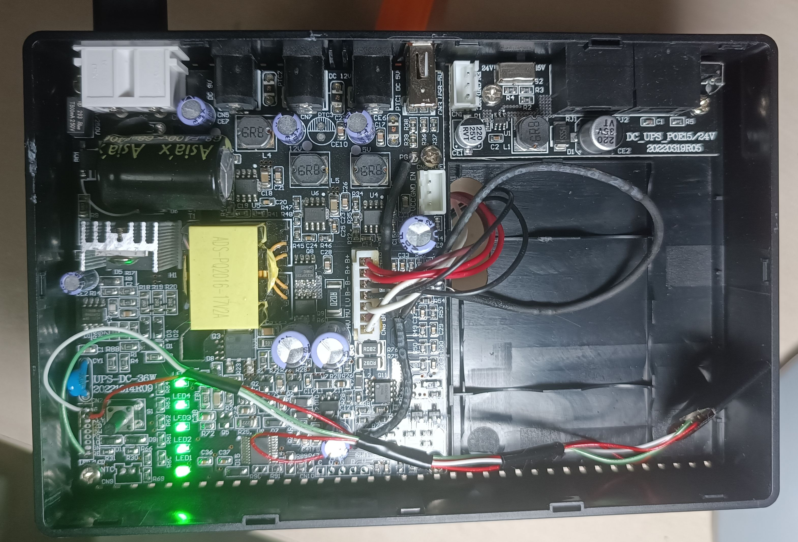

# Моніторинг напруги та доробки акумулятора UPS DC1036

Цей проєкт реалізує моніторинг напруги та заряду акумулятора для системи безперебійного живлення (UPS) на базі ESP8266 з використанням ESPHome.

Дані передаються через MQTT для подальшого аналізу та обробки.

Також був розширена емність аккумулятора в 3 рази:

## Обладнання

- ESP8266 (наприклад, плата ESP12F)
- Дільник напруги (резистори 1680 кОм та 100 кОм)
- Бінарний датчик для відстеження живлення від мережі (GPIO5)
- Акумуляторна батарея з діапазоном напруги 11.4 - 16.8 В

## Інструкція зі складання
Залийте прошивку будь яким способом, підключення вигляжає так

Підключення резисторів: підключіть резистори відповідно до схеми дільника напруги.

Підключення ESP8266:

- Дільник напруги до A0 (аналоговий вхід).
- Бінарний датчик RE до GPIO5 для відстеження живлення від мережі.
- Плюс живлення V (3.3 Вольта) до VCC
- Мінус живлення G до GND та IO15

Використання:

Після підключення та налаштування пристрій автоматично з'єднається з WiFi та MQTT-сервером.

Дані про напругу та заряд акумулятора будуть передаватися на MQTT-сервер у темах ups-dc1036/battery_voltage та ups-dc1036/battery_charge.

Стан живлення від мережі буде передаватися у темі ups-dc1036/upsdc_acpower.

Буде запущено веб сервер з статусом.

Якщо у вас виникли питання або пропозиції, будь ласка, зв'яжіться з автором проєкту (мною, vivalenta).
